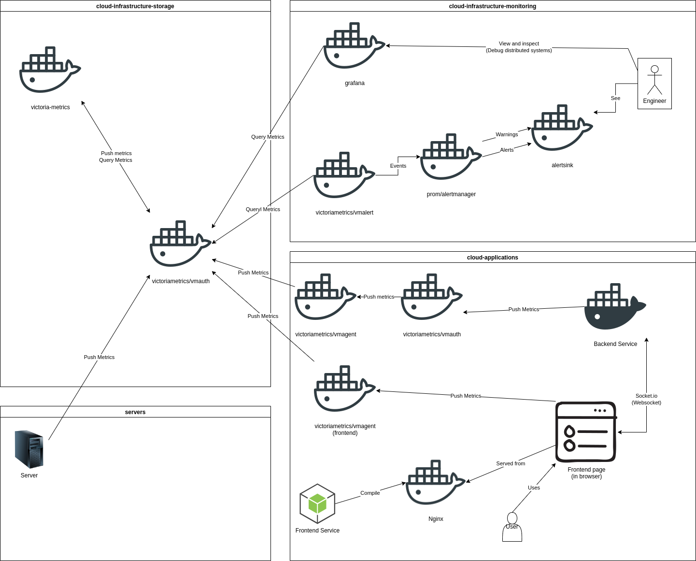
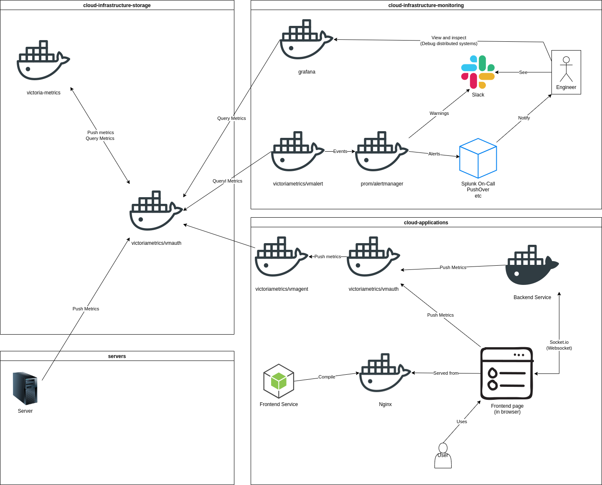

# VictoriaMetrics Full Stack

Example full stack server monitoring (visualizing and alerting). Including frontend microservices, backend microservices
and servers.
I built this and wanted to share as it might help someone.

See [LICENSE](LICENSE) file. Repo is as is where is. For example only and not for production!

## Notes

* Only tested on Linux (Ubuntu 22.04 LTS)
* Uses `docker0` (`172.17.0.1`) for the virtual machines to connect to (sorry non Linux users! IDK any alternative)
* Frontend is [http://127.0.0.1](http://127.0.0.1)
* Grafana is [http://127.0.0.1:3002](http://127.0.0.1:3002) - 3002 as NodeJS uses 3000 for development

## Current architecture

| Folder                          | Description                                                                   |
|---------------------------------|-------------------------------------------------------------------------------|
| cloud-infrastructure-storage    | VictoriaMetrics storage (TSDB) and authentication services                    |
| cloud-infrastructure-monitoring | Grafana and alerting services                                                 |
| cloud-applications              | A backend service and static frontend service that communicate over socket.io |
| servers                         | Vagrant virtual machines to collect server metrics (using Telegraf)           |

## Original plan

This is what I was planning for

Note: Slack and PushOver are replaced with a static container as to avoid putting secrets in the repo

## Running

Note: The servers may use a lot of ram as they spins up a bunch of virtual machines instances
16Gb minimum but 32Gb recommended!

Checkout / follow the [Makefile](Makefile) for details and commands

## Key Technologies

### cloud-infrastructure-storage (TSDB and authentication)
* VictoriaMetrics (TSDB)
* vmauth (VictoriaMetrics)

### cloud-infrastructure-monitoring (alerting and visualizing)
* Grafana
* vmalert (VictoriaMetrics)
* prom/alertmanager (Prometheus)
* alertsink (Placeholder for Slack, Spunk on-call or PushOver etc)

### cloud-applications (sample application)
* Socket.IO
* NodeJS static frontend
* Python backend
* APScheduler
* Flask
* Webpack
* vmauth (VictoriaMetrics)

### servers (sample server monitoring)
* Telegraf
* Ansible
* Vagrant
* Ubuntu

## Known issues / todo
* Frontend service (JS) InfluxDb does not seem to want to pass the auth token or any headers I pass it
* Create a service to do some chaos
* Create some alerts based off the chaos
